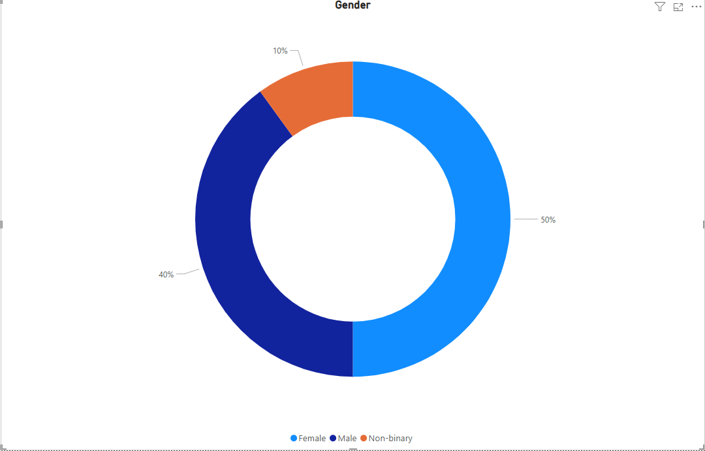
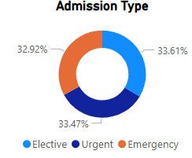
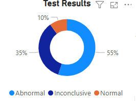
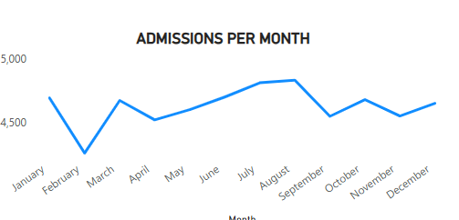
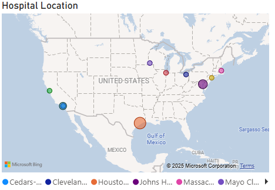
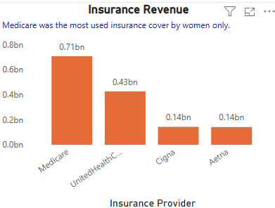
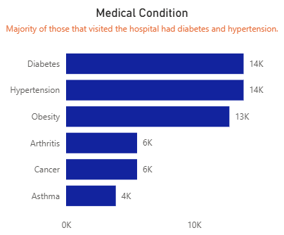

# 🏥 Healthcare Insights Dashboard

## 📌 Project Title and Description

**Healthcare Insights Dashboard – Zindua Group 10**

This project analyzes hospital data to uncover trends in patient demographics, common medical conditions, admission types, and hospital revenue performance. The primary goal is to create a Power BI dashboard that simplifies insights for healthcare stakeholders, enabling data-driven decisions to improve operational and clinical outcomes.

---

## 📂 Data Sources

The dataset used is fictional but mimics a real-world healthcare environment. Below is a summary of the cleaning and transformation steps:

| Step                     | Description                                                                 |
|--------------------------|-----------------------------------------------------------------------------|
| ✅ Removed Duplicates     | Ensured all records were unique.                                             |
| ✅ Checked Missing Values | Verified all critical fields (e.g., Patient ID, Age) were complete.          |
| ✅ Data Type Correction   | Converted fields like `Age`, `Date`, and `BillingAmount` to correct data types.       |
| ✅ Age Group Categorization | Created a new column to classify ages into: 18–24, 25–34, 35–44, 45–54, 55+. |
|✅Average days admitted     | Created a new column to get the number of days patients were admitted|
| 🗂 Dataset Format         | Excel (.xlsx), available in the repository as `Healthcare Analysis Dataset.xlsx`

---

## 📊 Results

The final Power BI dashboard provides a clear visual overview of the data across different dimensions. Below are highlights with embedded charts.

### 👥 Patient Overview

- **Total Patients**: 55,500  
- **Average Treatment Cost**: $25,539  

---

### 🔹 Gender Distribution

- **Female**: 50%  
- **Male**: 40%  
- **Non-binary**: 10%  

---

### 🏥 Admission Type Breakdown

- Elective: 33.61%  
- Urgent: 33.47%  
- Emergency: 32.92%  

---

### 🧪 Test Results

- Abnormal: 55%  
- Inconclusive: 35%  
- Normal: 10%  

---

### 📆 Monthly Admissions

Hospital visits remain fairly consistent throughout the year, with peaks in certain months.

---

### 📍 Hospital Locations

The top hospitals include:
- Cedars-Sinai
- Cleveland Clinic
- Mayo Clinic
- Johns Hopkins
- Massachusetts General

---

### 💸 Revenue Insights

- **Total Revenue**: $1.4 Billion  
- **Insurance Revenue**:
  - Medicare: $0.71B  
  - UnitedHealthcare: $0.43B  
  - Cigna: $0.14B  
  - Aetna: $0.14B  

---

### 🧓 Age Distribution

Patient age groups were distributed as follows:

- 18–24  
- 25–34  
- 35–44  
- 45–54  
- 55+  

Most elderly patients (55+) were women, with abnormal results and a preference for elective admissions.

---

### 🩺 Top Medical Conditions

| Condition     | Number of Patients |
|---------------|--------------------|
| Diabetes      | 14,000             |
| Hypertension  | 14,000             |
| Obesity       | 13,000             |
| Arthritis     | 6,000              |
| Cancer        | 6,000              |
| Asthma        | 4,000              |

---

## 🙌 Acknowledgments

Special thanks to:
- **Zindua Group 10** for collaboration and project ownership: Kemei Brenda, Emmanuel Favour Munyao,Kelvin Kipkemoi Ngetich
- **Zindua School** for mentorship and technical support
- Microsoft Power BI for enabling advanced analytics and data storytelling

---
